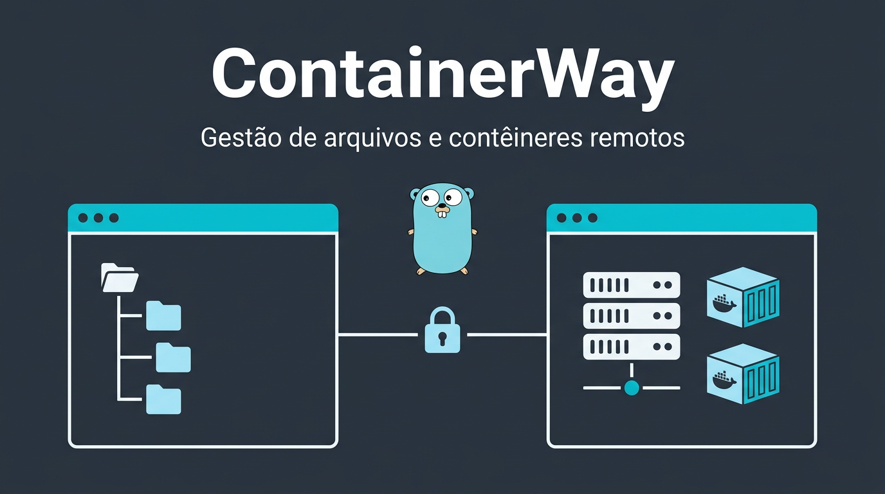

# ContainerWay



Gestor de arquivos de painel duplo (estilo WinSCP) para **Windows**, com foco em uso prático no dia a dia:

- painel esquerdo no **computador local**;
- painel direito no **host Linux** via **SSH/SFTP** ou dentro de **contêineres Docker** remotos;
- Docker acessado pelo socket Unix remoto (`/var/run/docker.sock`) **sobre SSH**, sem abrir API Docker em TCP.

Toda a interface está em **pt-BR**.

## Navegacao rapida

<details>
<summary><strong>Acesso local ao aplicativo</strong></summary>

Antes da tela de conexão SSH/SFTP, o app pede **login de acesso local** (usuário e senha armazenados nas preferências do app no Windows).

- **Usuário padrão:** `admin`
- **Senha padrão:** `!q1w2e3r4$`
- **Cadastro de usuários:** após entrar como `admin`, use **Usuários** na tela inicial da sessão (cartão **Configurações**) ou na barra superior do explorador. A tela de gestão abre **em janela maximizada**, com **Voltar** para retornar ao hub ou ao explorador. O `admin` não pode ser removido; no mesmo lugar há o atalho **Abrir configuração de alertas por e-mail…**.
- **Logs:** o nome exibido nos logs segue o cadastro de cada usuário.

> Atenção: isso **não** substitui autenticação do servidor SSH; é apenas uma trava local do app. Em ambientes sensíveis, altere a senha do `admin` e cadastre usuários com senhas fortes.


</details>

<details>
<summary><strong>Após conectar (tela inicial da sessão)</strong></summary>

Depois de **Conectar** com sucesso, abre-se primeiro a **tela inicial da sessão** (janela compacta e centralizada), com:

- **Pesquisar módulos** (filtro por palavra-chave);
- **Gerenciador de arquivos** — abre o explorador em painel duplo (no Windows/macOS a janela tende a **maximizar**);
- **Contêineres Docker** — lista e ações no host remoto;
- **Configurações** (somente **admin**) — atalhos para **Usuários** e **Alertas por e-mail**.

No explorador, o botão **Início** volta para essa tela **sem desconectar**. O botão **Sair** encerra a sessão SSH e retorna ao login de acesso local (a janela volta ao tamanho adequado).


</details>

<details>
<summary><strong>Alertas por e-mail (admin)</strong></summary>

Somente o usuário **admin** vê **E-mail** na barra do explorador ou no cartão **Configurações** do hub. A configuração abre em **tela cheia maximizada**, com **Voltar** no topo.

- ativar o envio e cadastrar **vários destinatários** (lista com **Adicionar**, **Remover selecionado** e **Remover e-mail digitado** — este último dispensa seleção na lista);
- alterações na lista são **gravadas automaticamente** no disco; se o envio estiver ativo e a lista ficar vazia, o app **desativa o envio** e informa (evita estado inválido);
- painel em **duas colunas** (destinatários | SMTP): texto de ajuda em bloco **rolável e compacto**; host e porta na mesma linha;
- **Salvar** (demais campos SMTP), **Enviar teste** e **Teste só no remetente (Gmail)** na barra inferior;
- a lista de destinatários em disco usa JSON; o legado de um único e-mail não sobrescreve mais uma lista vazia.

**Quando o app envia e-mails**

1. **Após o login de acesso local** com sucesso: aviso de quem entrou (conta, nome exibido, computador, data/hora).
2. **Ao encerrar a sessão do explorador** (botão **Sair**, fechar a janela no explorador ou encerrar após erro ao listar Docker): mensagem com o **registro daquela sessão** (mesmo formato do log de atividades). O corpo pode ser **truncado** (últimas linhas) se a sessão for muito longa; o arquivo completo continua no log em disco.

**Dicas (Gmail / Microsoft 365)**

- Gmail costuma usar `smtp.gmail.com`, porta **587**, conta com verificação em duas etapas e **senha de app** (pode colar com espaços; o app remove na hora de autenticar).
- O **From** deve ser coerente com a conta usada no SMTP.
- Mensagens para domínios corporativos (`@empresa`) podem ir para **spam**, **lixo** ou **quarentena** do Exchange; o teste só no remetente ajuda a ver se o Gmail aceita o envio.

**Privacidade:** usuário, senha SMTP e destinatários ficam nas **preferências locais** do aplicativo no Windows (como as credenciais de acesso local), não no repositório do projeto.

> Encerrar o processo pelo Gerenciador de Tarefas ou fechar o app na tela de login pode impedir o envio do resumo de sessão.


</details>

<details>
<summary><strong>Visão geral das funcionalidades</strong></summary>

### Conexão e login

- Conexão SSH com:
  - senha;
  - chave **OpenSSH/PEM**;
  - chave **PPK** (PuTTY), incluindo senha da chave.
- Configuração de verificação de host:
  - `known_hosts` (um ou mais arquivos separados por `|`);
  - ou opção explícita para ignorar chave de host (inseguro).
- Perfis de conexão:
  - salvar, carregar e excluir conexão;
  - manter segredo no disco (opcional) ou lembrar só na sessão atual.
- Teste rápido de conexão com status por etapa:
  - `SSH`;
  - `SFTP`;
  - `Docker`.
- Validação visual em tempo real no login:
  - host obrigatório;
  - usuário obrigatório;
  - senha ou chave obrigatória;
  - paralelismo entre `1` e `16`;
  - caminho da chave válido quando preenchido.
- Layout de login por abas:
  - `Conexões SSH/SFTP`;
  - `Chave e segurança`.

### Navegação e usabilidade no explorador

- Navegação por dois painéis:
  - esquerda: computador local;
  - direita: host remoto ou contêiner selecionado.
- Ações principais no topo:
  - **Início** (volta à tela inicial da sessão);
  - `Enviar`;
  - `Receber`;
  - `Histórico`;
  - `?` (manual completo do sistema);
  - **Usuários** e **E-mail** (somente para o usuário `admin`).
- Barra de navegação por painel com:
  - voltar;
  - subir nível;
  - início;
  - atualizar.
- Breadcrumbs clicáveis para navegação rápida por níveis.
- Busca por painel (local e remoto) com:
  - texto por nome;
  - filtro por extensão (`ext:log`);
  - filtro por tipo (`tipo:pasta`, `tipo:arquivo`);
  - seletor rápido (`Tudo`, `Pastas`, `Arquivos`);
  - limpeza automática ao trocar de pasta/contexto.
- Favoritos por painel:
  - adicionar pasta atual (`+`);
  - remover pasta atual (`-`);
  - persistência entre sessões.
- Duplo clique:
  - pasta abre;
  - arquivo local abre no app padrão do Windows.
- Edição remota estilo WinSCP:
  - abre arquivo remoto localmente;
  - monitora alterações;
  - envia de volta automaticamente ao salvar.
- Menus de contexto com ações de:
  - abrir;
  - enviar/receber;
  - atualizar;
  - copiar/colar;
  - renomear/excluir/criar pasta (conforme painel/contexto).
- Atalhos em diálogos de formulário:
  - `Enter` confirma;
  - `Esc` cancela.

### Transferências

- Transferência de arquivos e pastas:
  - local ↔ host;
  - local ↔ contêiner;
  - host ↔ contêiner (via fluxo interno de transferência).
- Suporte recursivo para diretórios.
- Drag-and-drop entre painéis para iniciar envio/recebimento.
- Copiar/colar entre painéis pelo menu de contexto.
- Transferência em lote de itens visíveis:
  - `Enviar visíveis`;
  - `Receber visíveis`;
  - confirmação antes de executar;
  - progresso por itens concluídos.
- Fila de transferências com:
  - progresso;
  - status de tarefa;
  - workers paralelos configuráveis (`1` a `16`).

### Histórico, retry e log geral

- Janela de histórico com abas:
  - `Sessão`;
  - `Log geral`.
- Filtro por texto no histórico e no log geral.
- Exportação de histórico filtrado para `.log`.
- Ações de recuperação:
  - tentar novamente última falha;
  - tentar novamente todas as falhas (com confirmação).
- Abertura rápida de:
  - arquivo do log geral;
  - pasta de logs.
- Persistência:
  - histórico de operações salvo entre sessões;
  - log geral acumulativo em arquivo com níveis `INFO` e `ERROR`.

### Docker remoto

- Lista apenas contêineres **em execução**.
- Identificação amigável com nome e ID curto no seletor.
- Listagem de diretório preferencial por `docker exec ls -1Ap` (direta e rápida).
- Fallback para método por tar quando necessário.
- No gerenciador de contêineres, os botões de reinício priorizam **recriação via Compose**:
  - tenta `docker compose up -d --force-recreate --pull always <serviço>`;
  - fallback para `docker compose ... --force-recreate` e `docker-compose ...`;
  - quando o contêiner não é Compose, usa `docker restart` como fallback.

### Ordenação de itens

- Ordenação estilo WinSCP:
  - `..` no topo;
  - depois pastas em ordem alfabética;
  - depois arquivos em ordem alfabética.

### Suporte a sudo em pastas protegidas (host remoto)

- Ao detectar permissão negada, o app pode abrir fluxo de elevação.
- Usuário informa credenciais sudo em diálogo.
- Fallback automático para `root` quando usuário informado não eleva para `uid=0`.
- Indicador visual de sudo ativo + ação para desativar.
- Cache temporário de validação sudo durante a sessão (TTL interno), evitando pedir senha repetidamente.
- Mensagens mais didáticas para cenários comuns (ex.: senha incorreta, usuário sem sudo, requisito de TTY).
- Operações com sudo ativo:
  - listagem de diretório;
  - abrir/editar arquivo;
  - upload/download de arquivo;
  - upload/download recursivo de pasta.


</details>

<details>
<summary><strong>Atalhos de teclado</strong></summary>

- `Enter`: abrir pasta no painel ativo.
- `Backspace`: subir um nível no painel ativo.
- `Tab`: alternar foco entre painel esquerdo e direito.
- `F3` / `Ctrl+F`: focar busca do painel ativo.
- `F5`: atualizar painéis.
- `F6`: transferir conforme o painel ativo (`Enviar` / `Receber`).
- `Ctrl+Shift+F6`: transferir itens visíveis em lote no painel ativo.
- `F2`: renomear item selecionado.
- `Del`: excluir item selecionado (com confirmação).
- `Ctrl+Shift+N`: criar pasta no painel ativo.


</details>

<details>
<summary><strong>Tecnologias utilizadas</strong></summary>

| Área | Tecnologias / pacotes |
|------|------------------------|
| Linguagem | Go |
| UI desktop | [fyne.io/fyne/v2](https://fyne.io/) |
| SSH | `golang.org/x/crypto/ssh` |
| Host key (`known_hosts`) | `golang.org/x/crypto/ssh/knownhosts` |
| SFTP | `github.com/pkg/sftp` |
| Chave PPK (PuTTY) | [`github.com/kayrus/putty`](https://github.com/kayrus/putty) |
| E-mail (SMTP) | `net/smtp` (pacote interno `internal/mailnotify`) |
| Docker remoto | `github.com/docker/docker` (cliente Moby) |
| Concorrência | goroutines, `sync`, `sync/atomic` |


</details>

<details>
<summary><strong>Requisitos</strong></summary>

- [Go](https://go.dev/dl/) 1.21+ (ou versão definida no `go.mod`).
- No Windows, Fyne requer **CGO**:
  - GCC ou Clang no `PATH`.
- Opções comuns no Windows:
  - [MSYS2](https://www.msys2.org/) + `mingw-w64-x86_64-gcc`;
  - LLVM-MinGW via Winget:
    - `winget install MartinStorsjo.LLVM-MinGW.UCRT`
- O `build.ps1` já:
  - recarrega `PATH` de usuário/sistema;
  - define `CGO_ENABLED=1`;
  - compila com `-H=windowsgui` (sem console abrindo junto).
- Execução no Windows Server (RDP/VM):
  - o app detecta falha de OpenGL automaticamente;
  - baixa runtime de fallback (`opengl32sw-64.7z`), extrai e relança o processo;
  - cria `opengl32.dll` local quando necessário e marca o arquivo como oculto.
- Servidor remoto:
  - OpenSSH com SFTP;
  - permissão de acesso ao Docker socket (`/var/run/docker.sock`) quando for usar contêineres.


</details>

<details>
<summary><strong>Compilação</strong></summary>

```powershell
.\build.ps1
```

Saída: `ContainerWay.exe` na raiz.

Build de validação sem GUI (CI/ambiente sem GCC para Fyne):

```powershell
go build -tags ci -o containerway_ci.exe ./cmd/containerway/
```


</details>

<details>
<summary><strong>Execução</strong></summary>

```powershell
.\ContainerWay.exe
```

Fluxo recomendado:

1. Abra a aba `Conexões SSH/SFTP`.
2. Selecione uma conexão salva ou preencha uma nova.
3. Ajuste `Chave e segurança` (se necessário).
4. Use `Testar conexão` para validar acesso.
5. Clique em `Conectar`.
6. Na **tela inicial da sessão**, abra o **Gerenciador de arquivos** (ou outro módulo).
7. No painel direito do explorador, escolha o contexto:
   - pastas do servidor;
   - ou um contêiner em execução.

Ao iniciar no Windows Server sem OpenGL nativo, o aplicativo tenta autoajuste de runtime e pode relançar automaticamente uma vez.


</details>

<details>
<summary><strong>Compatibilidade gráfica no Windows Server</strong></summary>

Para reduzir intervenção manual em servidores sem OpenGL nativo, o `ContainerWay.exe`:

1. testa criação de contexto OpenGL na inicialização;
2. se falhar, baixa pacote de software rendering (Mesa llvmpipe);
3. extrai o pacote (com fallback em Go puro quando `tar` não suporta `.7z`);
4. prepara `opengl32.dll` em caminho local carregável;
5. relança o processo com ambiente ajustado.

Diagnóstico:

- Log de bootstrap: `%LOCALAPPDATA%\ContainerWay\startup.log`.
- Cache de runtime: `%LOCALAPPDATA%\ContainerWay\runtime-mesa`.

</details>

<details>
<summary><strong>Estrutura do projeto</strong></summary>

| Caminho | Responsabilidade |
|---------|------------------|
| `cmd/containerway` | Ponto de entrada do app |
| `internal/appui` | Interface Fyne (login, explorador, ações, atalhos) |
| `internal/session` | Conexão SSH, cliente SFTP e cliente Docker |
| `internal/hostfs` | Operações no host remoto via SFTP |
| `internal/containerfs` | Operações em arquivos de contêiner |
| `internal/localfs` | Operações no sistema de arquivos local |
| `internal/fsutil` | Utilitários de entrada/listagem e ordenação |
| `internal/tarxfer` | Transferências recursivas com tar |
| `internal/transfer` | Fila, progresso e workers de transferência |


</details>

<details>
<summary><strong>Documentação para desenvolvimento</strong></summary>

- Guia rápido de manutenção e estudo: `SUMARIO_DESENVOLVEDOR.md`.
- Convenção adotada no código Go:
  - comentários de função em pt-BR imediatamente acima da função;
  - texto curto e objetivo, focando intenção e efeito da rotina.
- Recomendação para novas mudanças:
  - ao criar uma função nova, já adicionar o comentário no mesmo commit;
  - ao refatorar, manter o comentário alinhado com o comportamento atual.


</details>

<details>
<summary><strong>Segurança</strong></summary>

- Em produção, prefira validação de host por `known_hosts` e evite `Ignorar chave de host`.
- Segredos podem ser:
  - persistidos na conexão local (quando marcado);
  - ou mantidos somente na sessão atual (não persistente em disco).
- Fluxo sudo é usado apenas quando necessário para acesso a caminhos protegidos.

</details>

---

## Créditos

- Coordenador e idealizador do projeto: [Bruno Fernandes](https://bruno-fernandes.online)
- Apoio no desenvolvimento: [Hugo Januario](https://hugojanuario.online)
