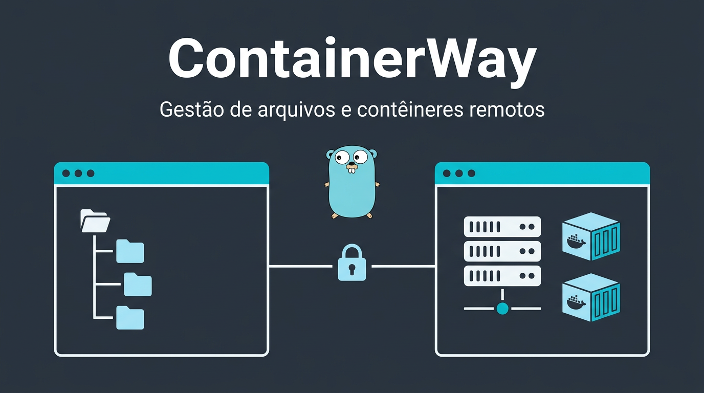

# ContainerWay



Gestor de ficheiros em painel duplo (estilo WinSCP) para **Windows desktop** e **interface web** local no browser (branch `dev_browser`) — SSH/SFTP, Docker remoto, explorador de contêineres e módulos operacionais no host Linux.

## Início rápido

| Objetivo | Comando |
|----------|---------|
| **App desktop** (Windows) | `.\scripts\build.ps1` → `.\ContainerWay.exe` |
| **App web** (browser, branch `dev_browser`) | Duplo clique em **`ContainerWay Web.exe`** (ou `.deb` Linux) — abre o browser; explorador com SFTP/Docker, editor, sudo e transferências — ver [docs/WEB_UI.md](docs/WEB_UI.md) |
| **Documentação completa** | [docs/GUIA.md](docs/GUIA.md) |

## Documentação

| Documento | Conteúdo |
|-----------|----------|
| [docs/GUIA.md](docs/GUIA.md) | Manual do utilizador (funcionalidades, build, execução) |
| [docs/ARQUIVOS.md](docs/ARQUIVOS.md) | Gerenciador de arquivos (explorador desktop e web) |
| [docs/WEB_UI.md](docs/WEB_UI.md) | Versão browser (MVP, API, roadmap) |
| [docs/SUMARIO_DESENVOLVEDOR.md](docs/SUMARIO_DESENVOLVEDOR.md) | Mapa do código e manutenção |
| [docs/SECURITY.md](docs/SECURITY.md) | Política local e notas de segurança |
| [docs/SCRIPTS.md](docs/SCRIPTS.md) | Scripts `.ps1`, `.bat` e `.sh` |
| [docs/README.md](docs/README.md) | Índice da pasta `docs/` |

## Scripts

| Script | Descrição |
|--------|-----------|
| `scripts/build.ps1` | Compila desktop (`ContainerWay.exe`) e pacotes Linux |
| `scripts/build-web.ps1` | Compila **`ContainerWay Web.exe`** (utilizador final) |
| `scripts/web/run.bat` / `run.sh` | Desenvolvimento: servidor sem empacotar |
| `scripts/release/publish-github-release.ps1` | Publica release no GitHub |

Detalhes: [docs/SCRIPTS.md](docs/SCRIPTS.md).

## Estrutura do repositório

```
ContainerWay/
├── README.md                 # Esta página (entrada do projeto)
├── go.mod, go.sum
├── assets/                   # Ícones e imagens
├── cmd/
│   ├── containerway/         # App desktop (Fyne)
│   ├── containerway-web/     # Servidor HTTP (browser)
│   └── iconforge/            # Utilitário de ícones
├── docs/                     # Toda a documentação (.md)
│   ├── GUIA.md
│   ├── ARQUIVOS.md
│   ├── WEB_UI.md
│   ├── SUMARIO_DESENVOLVEDOR.md
│   ├── SECURITY.md
│   └── SCRIPTS.md
├── internal/                 # Código Go (motor + UIs)
│   ├── appui/                # UI desktop Fyne
│   ├── webapp/               # API + UI estática web
│   ├── session/              # SSH, SFTP, Docker
│   ├── hostfs/, containerfs/, localfs/
│   ├── transfer/, tarxfer/
│   ├── connectcfg/, accessauth/, configdir/
│   └── …
├── packaging/linux/          # Flatpak, .desktop, metainfo
├── scripts/
│   ├── build.ps1             # Build desktop + Linux
│   ├── web/                  # run/build da versão web
│   └── release/              # Publicação GitHub
└── .github/workflows/        # CI
```

Binários gerados (não versionados): `ContainerWay.exe`, **`ContainerWay Web.exe`**, `dist/deb/`, `dist/deb-web/`, `dist/flatpak/`.

## Créditos

- Coordenador e idealizador do projeto: [Bruno Fernandes](https://bruno-fernandes.online)
- Apoio no desenvolvimento: [Hugo Januario](https://hugojanuario.online)
